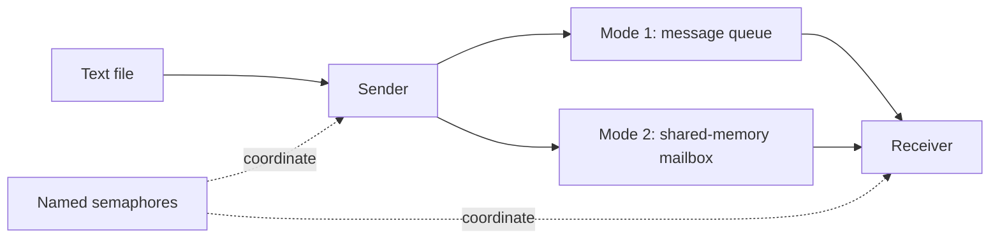

# Linux systems programming

Processes exchange messages, threads share work, and a kernel module exposes files through Linux VFS. These NCKU operating-systems labs implement those mechanisms in C, using the course templates.

`C` · `POSIX IPC` · `pthreads` · `procfs` · `Linux VFS`

[Lab map](#what-the-labs-do) · [IPC](#lab-1-one-transfer-two-ipc-mechanisms) · [Threads](#lab-3-shared-state-and-parallel-work) · [Filesystem](#lab-4-files-without-disk-persistence) · [Implementation notes](docs/implementation.md)

## What the labs do

| Lab | Observable behavior | Implementation |
| --- | --- | --- |
| 1: inter-process communication | A sender transfers text lines to a receiver through either a message queue or shared memory | [lab1-ipc](lab1-ipc) |
| 3: threads and synchronization | Threads update a shared counter, partition matrix work, and expose thread information through procfs | [lab3-threads](lab3-threads) |
| 4: in-memory filesystem | Files and directories use VFS operations with memory-backed storage, including reads/writes across block boundaries | [lab4-osfs](lab4-osfs) |

The repository contains **Labs 1, 3, and 4**, not the complete course. The Lab 1 sender and receiver compiled on Ubuntu 22.04 under WSL in the local check recorded on 2026-09-28. Runtime behavior and the kernel modules were not validated in that check; no speedup or official score is claimed.

## Lab 1: one transfer, two IPC mechanisms



The same sender/receiver interface selects either path with a mode flag. Named semaphores coordinate the programs. Timing brackets the send or receive call after the semaphore wait, so the recorded values exclude synchronization waiting and do not measure end-to-end transfer latency.

The [sender](lab1-ipc/sender.c) creates a semaphore for each side of the handoff (original inline comments omitted):

```c
g_sem_sender   = sem_open(SEM_SENDER_NAME,   O_CREAT, 0600, 1);
if (g_sem_sender == SEM_FAILED) die("sem_open sender");
g_sem_receiver = sem_open(SEM_RECEIVER_NAME, O_CREAT, 0600, 0);
if (g_sem_receiver == SEM_FAILED) die("sem_open receiver");
```

The receiver returns permission after consuming an ordinary message. Starting the sender semaphore at 1 and the receiver semaphore at 0 creates a one-message handshake, which prevents a normal single-pair run from overwriting an unread shared-memory message. This is an exercise in process coordination and measurement boundaries. See the [implementation notes](docs/implementation.md) for the handshake, the `xchg` lock, and VFS read/write addressing.

Build on Linux:

```bash
cd lab1-ipc
gcc -O3 -Wall sender.c -o sender -pthread -lrt
gcc -O3 -Wall receiver.c -o receiver -pthread -lrt
```

Start the sender, then the receiver in another terminal:

```bash
# Terminal 1
./sender 1 input.txt
# Terminal 2
./receiver 1
```

Use `2` in both commands for shared memory. Run one pair at a time: fixed IPC object names can make concurrent runs interfere.

## Lab 3: shared state and parallel work

| Directory | Mechanism |
| --- | --- |
| `1_1` | Shared counter protected by a pthread spinlock |
| `1_2` | Custom spinlock using x86 `xchg` |
| `2_1_2_2` | Single-thread and two-thread matrix multiplication |
| `3_1`, `3_2` | Row-partitioned matrix work and procfs kernel modules |

These exercises separate synchronization from work partitioning. They do not establish that two threads are always faster or that the implementations are race-free.

The `3_2` variant references a missing `3_2_Config.h` and local matrix inputs, so it is not self-contained. Some matrix variants accumulate into `malloc`-allocated output without explicitly zeroing it. Check numerical correctness before comparing execution times.

## Lab 4: files without disk persistence

The `osfs` module connects superblock, inode, directory, and file operations to Linux VFS. Memory-backed blocks hold file contents, including data spanning multiple blocks. Contents are not durable disk storage.

The [original test notes](lab4-osfs/docs/original-test-notes.md) describe mount and file-operation checks. Building needs kernel headers matching the target kernel. Load and test the module only in a disposable Linux VM, not on the host computer.

## Environment and validation limits

Lab 1's build check did not include a concurrent IPC run. Kernel modules were not loaded. The custom assembly is architecture-dependent, and kernel APIs can differ between releases. Source inspection and archived answers alone do not prove runtime correctness, performance improvement, or kernel stability.
