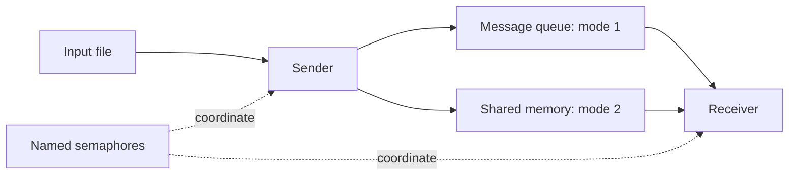

# Operating systems labs

Linux coursework exploring communication between processes, synchronization between threads, and an in-memory file system built on the kernel's VFS interface.

`C` · `POSIX IPC` · `pthreads` · `procfs` · `Linux kernel modules`

## Lab map

| Lab | Implementation | Code |
| --- | --- | --- |
| 1 | Sender and receiver using message queues or shared memory, coordinated by named semaphores | [lab1-ipc](lab1-ipc) |
| 3 | Spinlocks, threaded matrix multiplication, and thread information exposed through procfs | [lab3-threads](lab3-threads) |
| 4 | An in-memory file system with superblock, inode, directory, and file operations | [lab4-osfs](lab4-osfs) |

Only Labs 1, 3, and 4 are included. These are coursework implementations based on the course templates.

## Lab 1: two IPC paths

The sender reads lines from a text file. A mode flag selects a POSIX message queue or a shared-memory mailbox. Named semaphores coordinate the sender and receiver, and the programs record communication time.



Build on Linux:

```bash
cd lab1-ipc
gcc -O3 -Wall sender.c -o sender -pthread -lrt
gcc -O3 -Wall receiver.c -o receiver -pthread -lrt
```

Run each program in a separate terminal using the same mode. Start the sender first, then the receiver:

```bash
./sender 1 input.txt
./receiver 1
```

Use `2` in both commands to select shared memory. Run one pair at a time: the programs use fixed IPC object names, so concurrent runs can interfere with each other.

## Lab 3: synchronization and thread work

- `1_1`: a shared counter protected by a pthread spinlock.
- `1_2`: a custom spinlock using the x86 `xchg` instruction.
- `2_1_2_2`: single-thread and two-thread matrix multiplication variants.
- `3_1` and `3_2`: row-partitioned matrix work with kernel modules that expose thread information through procfs.

The `3_2` source references `3_2_Config.h`, which was not found with the original files. It also expects local matrix inputs. That variant is not a self-contained runnable example in this snapshot. Some matrix variants accumulate into `malloc`-allocated output without explicitly zeroing it; their numerical results need review before any performance comparison.

## Lab 4: in-memory file system

The `osfs` module implements file and directory operations through Linux VFS structures. File storage uses memory-backed blocks, including reads and writes across block boundaries. Its contents are not durable disk storage.

The [original test notes](lab4-osfs/docs/original-test-notes.md) describe the course's mount and file-operation checks. Building requires kernel headers that match the target kernel. Load and test the module only in a disposable Linux VM; this repository does not require loading a module on the host computer.

## Validation limits

On 2026-09-28, both Lab 1 programs compiled on Ubuntu 22.04 under WSL using the commands above. No concurrent IPC run or kernel module loading was performed during packaging.

Source inspection alone does not establish race freedom, speedup, or kernel stability. The custom assembly is architecture-dependent, and kernel APIs may differ between releases. No benchmark improvement or official course score is claimed.
