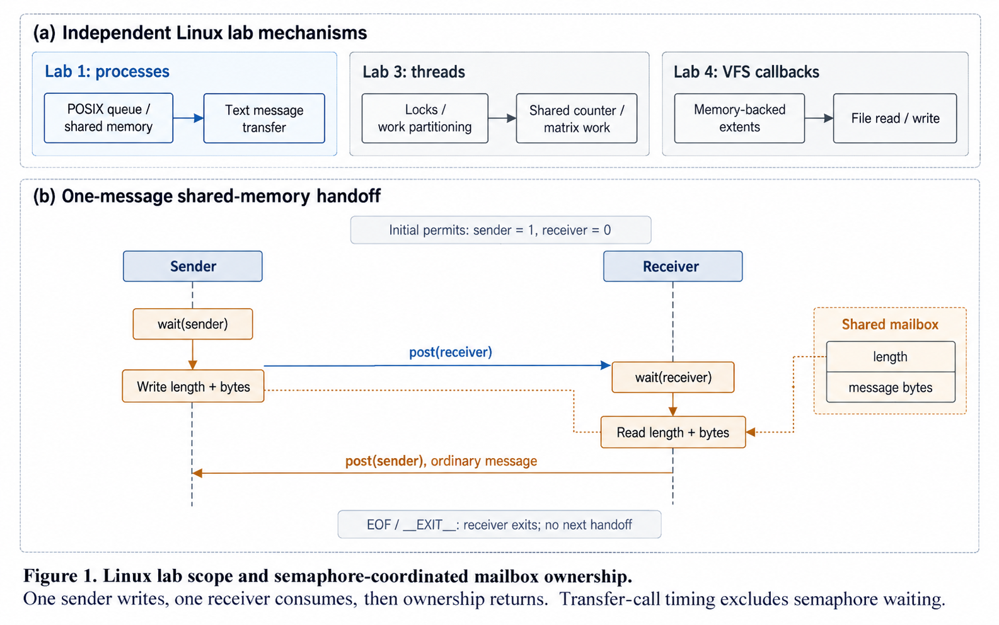

# Linux labs method figure

[Project overview](../README.md) · [Implementation notes](implementation.md) · [Generation prompt](prompts/method-overview.txt)

The upper panel separates IPC, thread synchronization, and a memory-backed filesystem. These are course exercises, not a single deployed system.

The lower panel shows the ordinary-message path in [sender.c](../lab1-ipc/sender.c) and [receiver.c](../lab1-ipc/receiver.c). The sender consumes its permit, transfers a message, and posts the receiver permit. After reading, the receiver returns the sender permit. Shared memory contains a length and message bytes; the alternate message-queue path uses the same semaphore handoff.

The depicted initial values assume newly created named semaphores. Existing objects can retain state. Terminal messages end the receiver rather than complete another ordinary handoff. This is a single sender/receiver exercise, not a general multi-producer queue.

The other panels refer to [thread examples](../lab3-threads) and [VFS operations](../lab4-osfs). A conceptual diagram does not establish runtime correctness, filesystem reliability, or performance. The README records the limited validation and known source issues.

## Figure provenance

Created with the built-in image-generation tool using the paper-comic paper-figure style. Labels and handoff arrows were checked against source. This AI-generated illustration is not a measured execution trace. The saved prompt documents the design constraints; source code remains authoritative.
